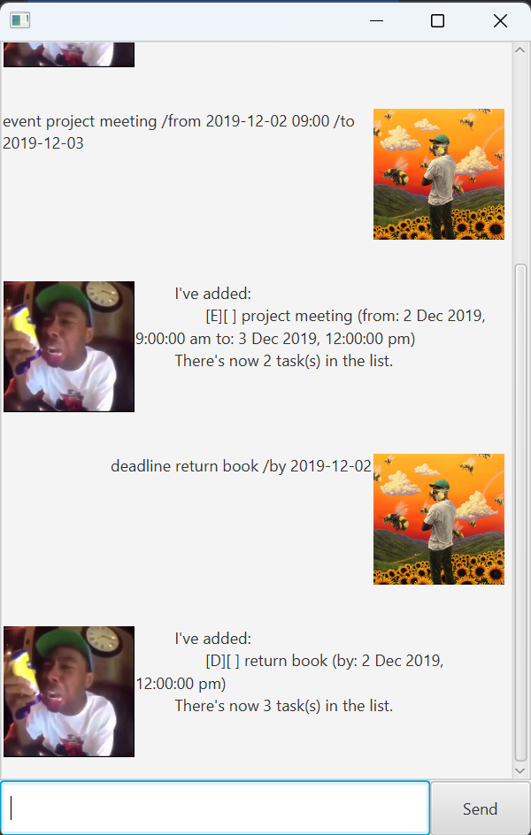

# Tyler User Guide



Welcome to Tyler, the most musical way to keep track of your tasks! 
This is a bot designed to take a load off your mind and have your 
tasks be organized **for you** instead of **by you**!

## Adding To-dos

You can add to-do tasks with no time restriction!

Example: `todo borrow book`

Tyler will confirm that your to-do task has been added!

```
I've added:
    [T][ ] borrow book

```

## Adding deadlines

You can add deadlines with a done-by time!

Example: `deadline return book /by 2019-12-02`

Tyler will confirm that your deadline has been added!

```
I've added:
    [D][ ] return book (by: 2 Dec 2019, 12:00:00 pm)
```

## Adding events

You can add event with from and to times!

Example: `event project meeting /from 2019-12-02 09:00 /to 2019-12-03`

Tyler will confirm that your event has been added!

```
I've added:
	[E][ ] project meeting (from: 2 Dec 2019, 9:00:00 am to: 3 Dec 2019, 12:00:00 pm)
```

## Find tasks in multiple ways

You can find tasks by date or with a keyword!

Example: `find book`

Output:

```
Here are the matching tasks in your list:
1. [T][ ] borrow book
2. [D][ ] return book (by: 2 Dec 2019, 12:00:00 pm)
```

Example: `date 2019-12-02`

Output:

```
1. [D][X] return book (by: 2 Dec 2019, 12:00:00 pm)
2. [E][ ] project meeting (from: 2 Dec 2019, 9:00:00 am to: 3 Dec 2019, 12:00:00 pm)
```

## Delete Tasks

You can remove tasks!

Example: `delete 3`

Tyler will confirm that your task has been deleted!

```
I've removed this task:
[E][ ] project meeting (from: 2 Dec 2019, 9:00:00 am to: 3 Dec 2019, 12:00:00 pm)
```

## Mark and unmark tasks

You can mark tasks as complete or mark them as incomplete!

Example: `mark 2`

Tyler will confirm that your task has been marked!

```
I've marked this task as done:
	[D][X] return book (by: 2 Dec 2019, 12:00:00 pm)
```

Example: `unmark 2`

Tyler will confirm that your task has been unmarked!

```
I've marked this task as incomplete:
	[D][ ] return book (by: 2 Dec 2019, 12:00:00 pm)
```

Tyler can make planning a breeze!